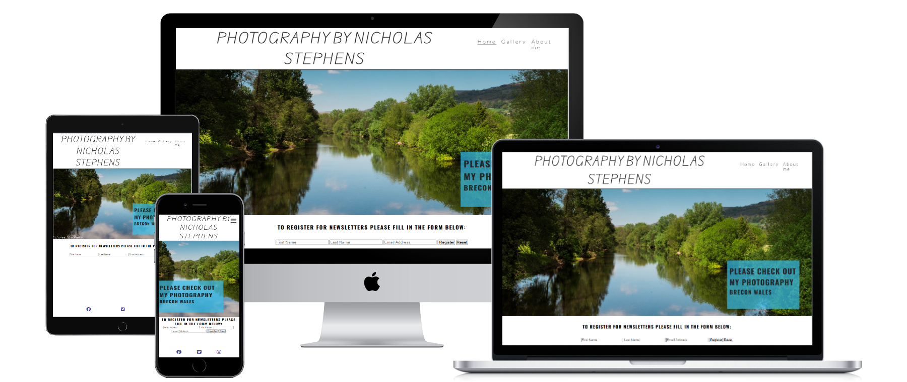
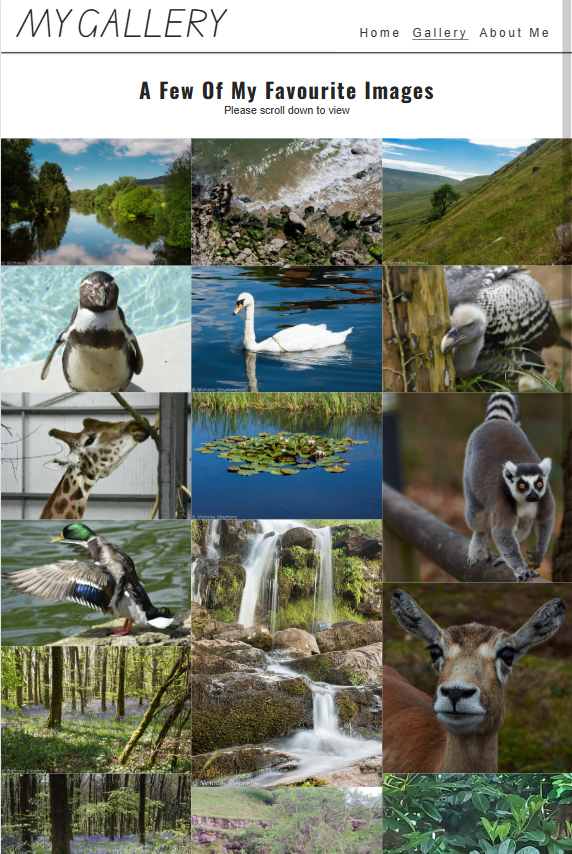
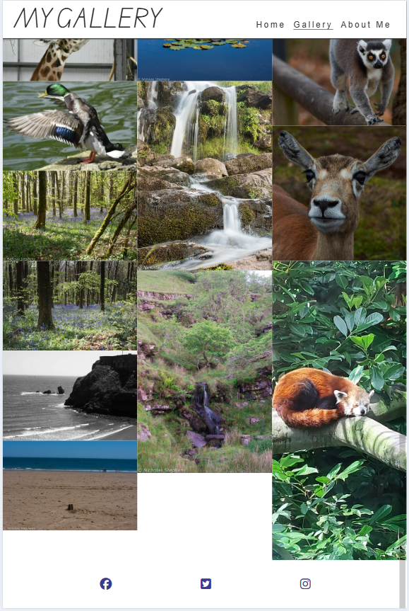
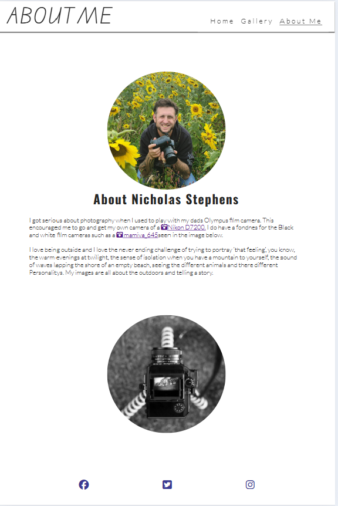

# NICHOLAS STEPHENS PHOTOGRAPHY
The photography website is a site for people to veiw photos ia hve taken. This site is amied towards other photographers and non photographers alike to be able to look at the images and in future update alow purtches of images but for now they can subscribe to the newsletter.

## UK
This site is designed no to be over complicated with simplisity in mind, this site is done to keep the user intrested with clear accessible way to navigate to the different pages. The navigation bar has the sites name with the three navigation lines that sticks to the top of the page while the user scrolls down the page alowing it to be accsessed at any point as the user clicks on the different pages a black line will stay under the name of the page they are on so that the usere wwent away from the device being used thay will know whe theyt get back. There are three pages to this site the home page (index.html), gallery page (gallert.html) that has my favourite images, and the information page (information.html). These pages have no pop up adds that could disstract the user away from the pages.

### Colour Scheme
This site utillies the basic colour for the text and the background,
color chart used.

- `#3a3a3a`  used for secondary text and shadow boxing.
- `#252525`  used for  h1 h2 h3 and logo.
- `#ffffff`  used for header background.
- `rgba(55, 191, 233, 0.7)` cover text back ground.
- `#3b3a92` social-networks icons colour.

---

### Typography
On this site Google font and Awesome libraries are used.

The "lato" and Oswald" font from Google was use for all the font and dropdown menu texts.

- [Lato](https://fonts.google.com/specimen/Lato)
- [Oswald](https://fonts.google.com/?query=oswald)

The Logo text was changed to Australia VIc as to try not to make the sire to blocky.

- [Australia Vic](https://fonts.google.com/?query=edu+au+vic+wa+nt+pre)

I used Font Awesome for the three lines in the menu, and logo in the tab for pc/laptops screens, and also links to off site.

- [Tab camera icon](https://icons8.com/icons/set/favicon-camera)

Camera icon used for the links to other pages

- [Camera icon](https://fontawesome.com/v6/search?q=camera&o=r&m=free)

The bars icon to click on the briongs out the dropdown menu.
 
 - [Three bars icon](https://fontawesome.com/v6/search?q=bars&o=r&m=free)
 
  ---

### Fratures 

#### Page Features
- Home page

My home page is what the user will first see when entering the site from either phone tablet or pc, The hero image on the homepage is a nice simpile image from my own collection in the town where i live. this i has a simple but clear message to explore the site and to go to the gallerys page. There is input boxes at the bottom of the screen just before the footer alowing users to sign up to the newsletter.

- Gallerys page

The Gallerys page i have had to screen shot in different images to cover all the information.
This page is a simple design keeping the page name at the top right and having the dropdown menu change with the screen size from three bars, the gallerys name is underlined and a simple but clear messsage at the top of the page.
All the images are set up to a max of 4 colloums wide and min of 1 colloums.
The footer is set as sticky alowing the images to flow over the top footer untill you get to the bottom and it is exposed.

- Information page

This is my information page this is not a form page but that of a small bit about myself, this page contains an image of my self some text and links to google images of the equipment i use.

---

### Features for the future

- Members Section
  - Users will be able to click on the images to make them bigger with image discription.

- Buying
  - Users will be able to purchase images.

  - Users will be abele to sign and purchase group or one to one course.
 
## Tools & Technologies used

 - HTML 
    - Code_insitute runnging project
    - YouTube
 - CSS 
    - code_insitute
 - Git 
    - (git add, git commit, git push)
 - GitHub Pages
    - used to delopy site
 - Markdown Builder
    - Tim Nelson's markdown files
 - Goolge Fonts
    - used for the site text
 - https://websitemockupgenerator.com/ 
    - used to show images on different screens

---

    ## Acknowledgments 

 - I would like to thank Code insitute for the course that i could get the knowledge to do this prodject.

 - I would like to thank the other students on slack that have helped the errors and information along the way such as:
    - Steve Powell_4p
    - Shaun_W_4p
    - Kris
    - CJ_Perkins_4p
    - Ax de klerk_4p

 - I would like to thank my mentor Spencer form Code Institute
 - I would like to thank my family for testing out the site and giving me feed back, and for my wife for helping me with spelling.

