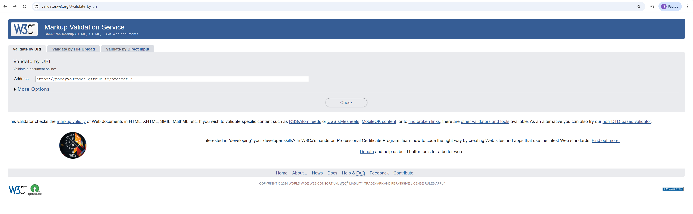
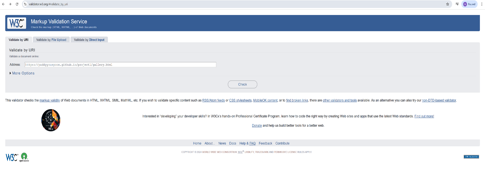
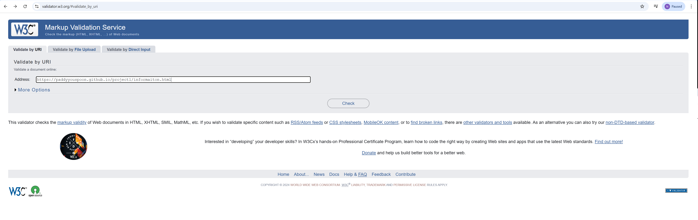
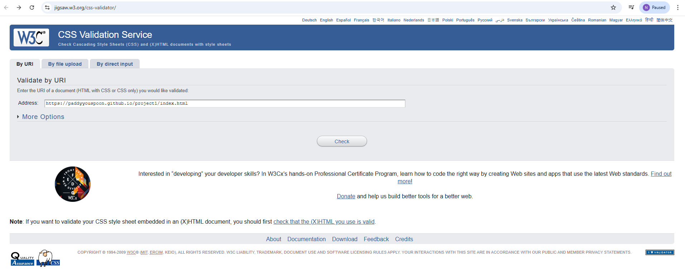
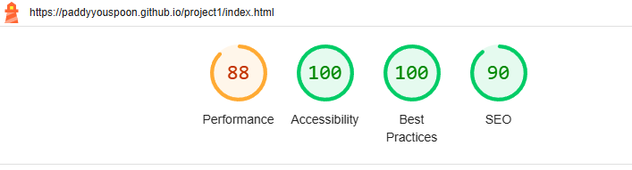
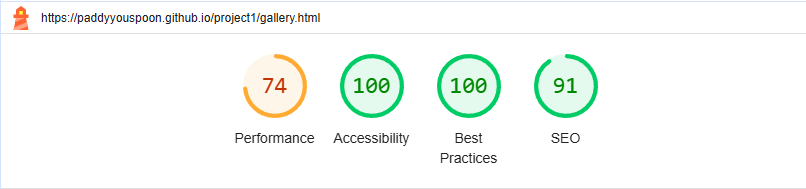
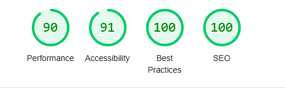
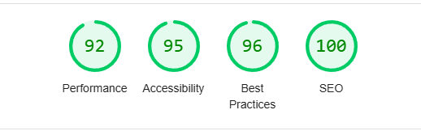
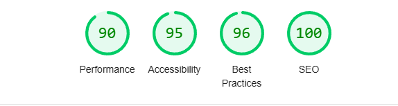

# Testing 

## Code Validation

### HTML 

I used [HTML Validator](https://validator.w3.org) recommended to make sure my files are validated.

| Page | Screenshot | Any Errors|
| --- | --- | --- |
| Home Page |  | [errors](https://validator.w3.org/nu/?doc=https%3A%2F%2Fpaddyyouspoon.github.io%2Fproject1%2F) |
| Gallarys Page |  | [errors](https://validator.w3.org/nu/?doc=https%3A%2F%2Fpaddyyouspoon.github.io%2Fproject1%2Fgallery.html) |
| Information Page |  | [errors](https://validator.w3.org/nu/?doc=https%3A%2F%2Fpaddyyouspoon.github.io%2Fproject1%2Finformaiton.html) |

---

### CSS

I used [CSS Validation](https://jigsaw.w3.org/css-validator/) recommended to make sure my files are validated

| CSS File | Screenshot | Any Errors |
| --- | --- | --- |
|styles.css |  | [no errors](https://jigsaw.w3.org/css-validator/validator?uri=https%3A%2F%2Fpaddyyouspoon.github.io%2Fproject1%2Findex.html&profile=css3svg&usermedium=all&warning=1&vextwarning=&lang=en) |

---

### Lighthouse testing

I have use Lighthouse tool recomended my Code Institute to check for any issuse in my site.

| Page | Size | Screenshots | Any information |
| --- | --- | --- | --- |
| Home Page | Mobile |  | Large image contenet (LCP)  |
| Home Page | Desktop |  | Large image content (LCP)
| Gallerys Page | Mobile |  | Large image files (LCP) |
| Gallerys Page | Desktop |  | Large image files (LCP) |
| Information Page | Mobile |  | Large image files (LCP and SEO)
| Information Page | Desktop |  | (SEO) no meta sescription |

---

### Bugs

I had several isuses 

1. Issue with facebook instagram and twitter (X) links not working, this bug was fixed with help from student Kris mentioning that my CSS code Z-index was -1 not 0.

  

2. Index page was not getting any information from the style sheet, bug fixed with help from CJ_Perkins, i had put stylessheet instead of stylesheet.

3. Naw layout at the to as the name logo was clipping the three bars now with the image logo this has stopped.

  

  ---

  ### light house re-testing

  | page | Size | screenshots |
  | --- | --- | --- |
  | Home page | Mobile |  |
  | Home Page | Desktop |  |
  | Gallerys Page | Mobele |  |
  | Gallerys Page | Desktop |  |
  | Information Page | Mobile |  |
  | Information Page | Desktop |  |

  ### Code Validation Re-testing 

  I had some errors in my original code

  | Page | w3 | Any Errors |
  | --- | --- | --- |
  | Home Page | [w3v](https://validator.w3.org/nu/?showsource=yes&useragent=Validator.nu%2FLV+https%3A%2F%2Fvalidator.w3.org%2Fservices&acceptlanguage=&doc=https%3A%2F%2Fpaddyyouspoon.github.io%2Fproject1%2F) | no errord |
  | Gallerys Page |